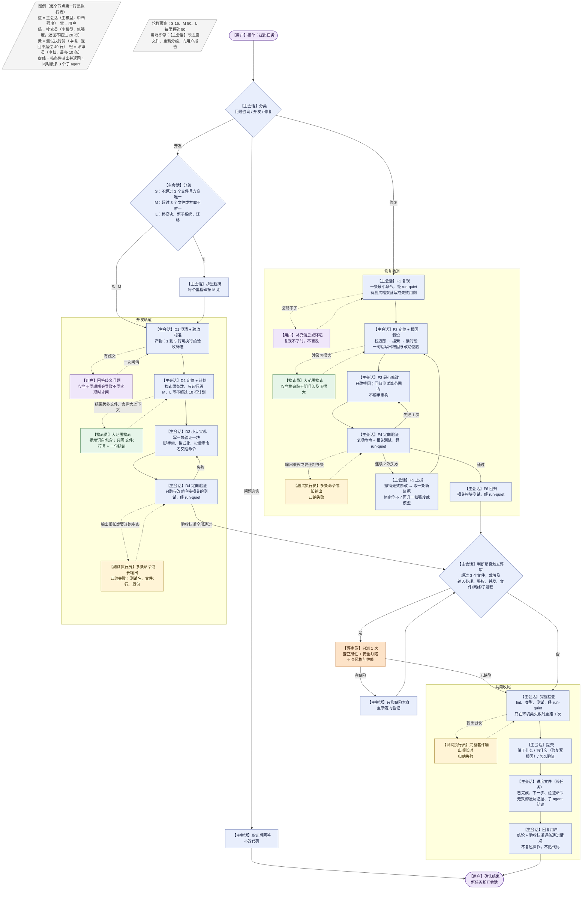

# 开发与修复整体流程

一套按额度设计的端到端流程。它把 `AGENTS.md` 里的规则串成有先后、有门禁、有产物的步骤：每一步只做该步的事，进入下一步要拿出上一步的产物。适用于任何编码 agent 终端；角色名与模型档位的对应见第 6 节。

## 0. 设计原则

1. **三层执行，顺序不能反**：先靠配置（模型分档、并发上限），再靠工具（run-quiet、hook），最后才靠提示词里的流程约定。
2. **阶段门禁**：每个阶段有进入条件和退出产物，没有产物不进下一步；返工只退到出问题的那一步，不从头来。
3. **贵模型做判断，便宜模型做搬运**：澄清、设计、根因判断用主模型；搜索、跑测试、归纳失败用小模型或中档模型。
4. **每次"改"之前都有一条证据**：复现、栈追踪、根因假设、失败用例，缺一条就先补证据。
5. **轮数是止损信号，不是目标**：超过预算先停下看进度、重新分级，而不是继续试。

## 1. 总流程

渲染好的图：[docs/workflow.svg](docs/workflow.svg)（源文件 `docs/workflow.mmd`，改图后用 mermaid-cli 重新渲染）。GitHub 上下面的 Mermaid 会直接显示。

## 2. 分级：决定后面每一步的力度

| 级别 | 判定 | 计划 | 子 agent | 评审 | 轮数预算（默认，可调） |
| --- | --- | --- | --- | --- | --- |
| S | 改动不超过 3 个文件，且方案唯一 | 不写 | 不派 | 不派，除非触及敏感面 | 15 |
| M | 超过 3 个文件，或方案不唯一 | 不超过 10 行：文件清单、要加的测试、验证命令 | 需要时派 1 次搜索员 | 触发条件满足时派 1 次 | 50 |
| L | 跨模块、新子系统、迁移 | 先拆里程碑，每个里程碑按 M 走 | 每个里程碑不超过 3 个 | 每个里程碑 1 次 | 每个里程碑 50 |

敏感面：输入处理、鉴权、并发、文件/网络/子进程调用。触及即触发评审，与级别无关。
轮数预算用完还没到收尾：停下，写进度文件，重新分级或向用户报告，不继续试。

## 3. 开发轨道

每步三项：做什么、谁做、退出产物。

**D1 澄清与验收标准**
- 做什么：判断任务描述是否有歧义且不同理解会导致不同实现。有就一次问清，把可选的理解列出来让用户选；没有就按最合理的解释做并写明假设。随后写 1 到 3 行可执行的验收标准。
- 谁做：主会话，主模型。
- 退出产物：验收标准，例如"`pytest tests/test_x.py -k new_case` 通过"或"调用 /api/x 返回 201 且写入一条记录"。

**D2 定位与计划**
- 做什么：先搜索再读行段，找到要改的位置。改动跨很多文件、搜索结果会很大时派一次搜索员，提示词自包含，返回不超过 20 行。S 级不写计划；M、L 级写不超过 10 行的计划：改哪些文件、要加哪些测试、用什么命令验证。L 级先拆里程碑。
- 谁做：主会话定位与写计划；大范围搜索交给搜索员（小模型）。
- 退出产物：文件清单；M、L 另有计划；L 另有里程碑列表。

**D3 小步实现**
- 做什么：按文件推进，写一块验证一块；能先写测试就先写测试再写实现。脚手架、格式化、批量重命名交给命令。刚编辑过的文件不重读。
- 谁做：主会话。
- 退出产物：每个文件的改动都有对应的定向验证通过记录。

**D4 定向验证**
- 做什么：只跑与改动直接相关的测试或命令，一律经 run-quiet。失败回 D3；同一处连续两次修不好，按修复轨道的 F5 止损。
- 谁做：主会话直接跑；输出会很长或要连跑多条命令时派测试执行员（中档）。
- 退出产物：验收标准逐条通过。

**D5 评审（条件触发）**
- 做什么：改动超过 3 个文件或触及敏感面时，派一次评审员查正确性与安全缺陷，不查风格与性能。有缺陷回 D3，只修缺陷本身。
- 谁做：评审员（中档）。
- 退出产物：评审员回复"未发现"，或缺陷已修复并重新验证。

**D6 收尾**：见第 5 节。

## 4. 修复轨道

**F1 复现**
- 做什么：一条最小命令复现并记录失败信息。有测试框架时把复现写成一个失败用例。复现不了：说明尝试过什么，向用户要更多信息或环境，不盲改。
- 退出产物：复现命令与失败信息，或失败用例。

**F2 定位与根因假设**
- 做什么：报错或栈追踪 → 搜索 → 读相关行段，不派 agent 泛泛调查；栈追踪不明且涉及面很大时才派搜索员。动手前用一句话写出根因假设和要改的位置。
- 退出产物：根因假设，形如"X 在条件 Y 下返回 Z，导致 W；改 文件:函数"。

**F3 最小修改**
- 做什么：只改导致问题的逻辑。回归测试和同一根因的其他实例算在范围内；重构、格式化无关代码不算。
- 退出产物：diff 只包含根因相关的改动与回归测试。

**F4 定向验证**
- 做什么：先跑复现命令（或失败用例），再跑相关测试，一律经 run-quiet。
- 退出产物：复现命令通过、相关测试通过。

**F5 止损（两次失败即停）**
- 做什么："一次失败"指一次完整的修改加验证后复现仍失败。连续两次：撤销无效修改，回到 F3 之前的状态；取一条新证据（加日志、缩小复现、读上游调用、对比可用版本）；带着证据回 F2 重写根因假设。取证后仍无法定位，再把强度或模型提高一档，不在低档反复试。
- 退出产物：新证据与新的根因假设。

**F6 回归与评审**
- 做什么：跑相关模块的测试；触及敏感面或改动超过 3 个文件时派一次评审员。
- 退出产物：回归通过，评审通过。

**F7 收尾**：见第 5 节，提交说明写清根因。

## 5. 共用收尾

1. 提交前跑一次项目约定的完整检查（lint、类型、测试），经 run-quiet。真正的失败要修；只有在测试体未开始前就死掉（环境、安装、runner）或同一提交此前通过过时才重跑一次。
2. 提交：一个逻辑改动一个提交。提交信息写做了什么、为什么（修复要写根因）、怎么验证的（命令）。
3. 进度文件（长任务或会话要中断时）：已完成、下一步、验证命令、已试过且无效的修法及证据、已派出的子 agent 及结论。
4. 回复用户：结论、验收标准逐条的通过情况、未做的事与原因。不复述操作，不贴代码。
5. 结束：任务完成后提醒可新开会话；不在同一会话里接无关任务。

## 6. 角色与档位

| 角色 | 用在哪一步 | 模型档 | 返回上限 | Claude Code | Codex |
| --- | --- | --- | --- | --- | --- |
| 主会话 | D1、D2 计划、D3、F2 根因、F3，以及所有判断 | 主模型，默认中档强度；设计与疑难调试临时调高 | 无 | 当前会话模型 | 当前会话模型 |
| 搜索员 | D2、F2 的大范围搜索 | 小模型，低强度 | 20 行，超限落盘 | Explore（haiku） | explorer 角色（low） |
| 测试执行员 | D4、F4、收尾中输出很长或多条命令时 | 中档 | 40 行，超限落盘 | test-runner（sonnet） | test-runner 角色（medium） |
| 评审员 | D5、F6 | 中档 | 40 行，最多 10 条 | reviewer（sonnet） | reviewer 角色（medium） |

同时最多 3 个子 agent；子 agent 只在 D2/F2、D4/F4、D5/F6 出现，其余步骤不派。

## 7. 额度控制点

| 泄漏点 | 在哪一步 | 对策 |
| --- | --- | --- |
| 需求理解错导致整套返工 | D1 | 一次澄清加验收标准 |
| 通读目录和整文件 | D2、F2 | 搜索限制条数，读行段；大范围搜索交给搜索员 |
| 测试和日志全文进入上下文 | D4、F4、收尾 | run-quiet；hook 自动改写 |
| 猜测和尝试循环 | F3、F4 | 两次失败即停，撤销后取证 |
| 顺手重构扩大范围 | D3、F3 | 最小修改；回归测试才算范围内 |
| 派发无门槛、多维度评审 | D2、D5 | 三问；评审只派一次，只查正确性与安全 |
| 冗长回复 | 收尾 | 只讲结论与验收结果 |
| 会话堆积 | 全程 | 一个会话一件事；进度文件；压缩时按保留清单 |

## 8. 异常处理

| 情况 | 做法 |
| --- | --- |
| 复现不了 | 报告尝试过的命令与环境差异，向用户要信息；不改代码 |
| 需求有歧义 | 列出 2 到 3 种理解与各自影响，一次问清 |
| 没有测试框架 | 用一条可重复的命令当验收标准；不为一次修复引入测试框架 |
| 测试不稳定 | 只在测试体未开始前死掉或同一提交此前通过过时重跑一次；否则当真失败处理 |
| 环境坏了（依赖、网络、权限） | 先确认同一命令在改动前也失败，报告并停止，不绕过 |
| 需要用户决策（架构、破坏性改动、外部影响） | 停在决策点，给出建议与理由，不先做 |
| 轮数预算用尽 | 写进度文件，重新分级，向用户报告进度与阻塞 |

## 9. 度量

- 安装前在 Claude Code 的 /usage 或 Codex 的 /status 记一周基线：总量、子 agent 占比。
- 每个任务结束记三件事：级别、实际轮数、是否触发过 F5 止损。
- 两周后比较：总量应降，子 agent 占比应降，F5 触发次数应减少。没有变化先查强制层（/hooks、/agents、/context）是否生效，再改规则措辞。

## 10. 一页清单

- 开发：澄清 → 验收标准 → 分级 → 计划（M、L）→ 小步实现 → 定向验证 → 评审（条件）→ 完整检查 → 提交 → 进度文件。
- 修复：复现 → 定位 → 根因假设 → 最小修改 → 定向验证 →（连续两次失败：撤销、取证、回定位）→ 回归 → 评审（条件）→ 完整检查 → 提交并写根因。
- 任何时候：搜索不通读；输出经 run-quiet；子 agent 提示词自包含且限返回长度；回复只讲结论。
